# Final_Project_10_UTA

## Project Overview
The aim of the project is to predict how seasonal changes and quarterly fiscal earnings affect the price of Apple Stock Market. To predict this information, multiple variables, such as date in months, years and different seasons of the year  will be analyzed to gauge their impact and predict potential price outcomes.

## Description of the Communication Protocols
	
	X: Gabriel 
	–Decide the technologies to be used for each step of the project & Create Dashboard
	
	Circle: Remi 
	– Database Integration
	
	Square: Ope
	– GitHub Repository & Presentation
	
	Triangle: Iry
	– Machine Learning Model

## Content
### Selected Topic
As it relates to human behavior, how do seasons and fiscal quarters compare in stock behavior, using AAPL stock?

### Why this topic?
This topic was chosen to demonstrate that all things are connected, from all things environmental, as it relates to human behavior, transferred into the stock market where humans often make decisions based on science, but even more so on emotions and gut feelings. This model is set to demonstrate this as we observe stock behavior of Apple, Inc.

### Data Source
The data utilized is from Kaggle.com, titled the “NYSE”.

- https://www.kaggle.com/varpit94/apple-stock-data-updated-till-22jun2021

### Questions We Hope to Answer
Do seasons, as in changes in the weather, trigger human behavior enough to show a trend in stock price highs?
Do fiscal quarters trigger a trend of stress in humans that affect human behavior and is reflected within the stock markets highs (or volume purchases?)
Do different months of the year trigger 

## Dataset Overview
### Data Source
This dataset, from Kaggle.com, provides historical data of APPLE, INC's (AAPL) stock. The data is available at a daily level, in USD, and is located at the following link:
- https://www.kaggle.com/varpit94/apple-stock-data-updated-till-22jun2021

This dataset contains:
- Data 
- High: Price from the first transaction of a trading day
- Low:Minimum price in a  trading day
- Close: Price from the last transcation of a trading day
- Adj Close: Closing price adjusted to reflect the value after accounting for any corporate actions
- Volume: Number of units traded in a day

### Data Quality
In the Kaggle webpage, this dataset is rated with a score of 10.0 for Data Usability.

## Mock Up Overview
As mentioned, we are using Apple, Inc's data set that consists of daily stock prices from 1980 - 2020. This data set is being analyzed by changes in open, close, high, and low prices on a daily base. Each of these changes are to be analyzed in their own separate databases where they will be analyzed against seasons and quarters. The following information will explain our plan from the raw data to machine learning model in effort to predict what seasons and quarters produce the most gains and losses of a stock. The following will be covered in this section:
- Database Mockup
- Machine Learning Mockup

### Database Mockup
In this section we will be discussing the databases we have created that will be utilized for our machine learning model. To get an idea as to what our database will look like once joined, the following is a snapshot of our ERD model:

1. In our base APPL stock database, we will create two formulated columns. This example will be based on our database "AAPL_Mock_ML_Open.csv"
    - The first formulated column is based on the changes that occur every 24 hours of on the stock. The current day's price will be subtracted from the previous day's price. The very first row of that coumn is subtracted from zero.
    - Once this formula is applied throughout the database, we will then create a Gain_Loss column. This column will be formulated to state "Loss" if the price change is less than zero and will state "Gain" if the price change is zero or greater than 

2. Once the Price change and Gain_Loss columns are created, next we will format the date column in both databases to match. The date is the key that will bring both databases together. It is unique by every line having a different date. This will ensure that the information in database one is properly matched with all of the data of database two

3. Lastly, we will be joining the Season/Quarter database with the APPL stock price database using a SQL based program, ideally Postgres, or another program like it. The following images show the databases before the join, and a snapshot after the join that is already imported into a dataframe.

  - DB_1

    - 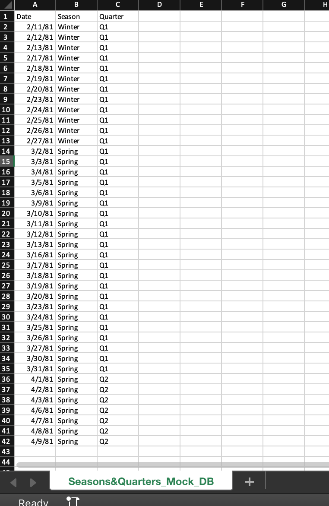

 - DB_2

   - 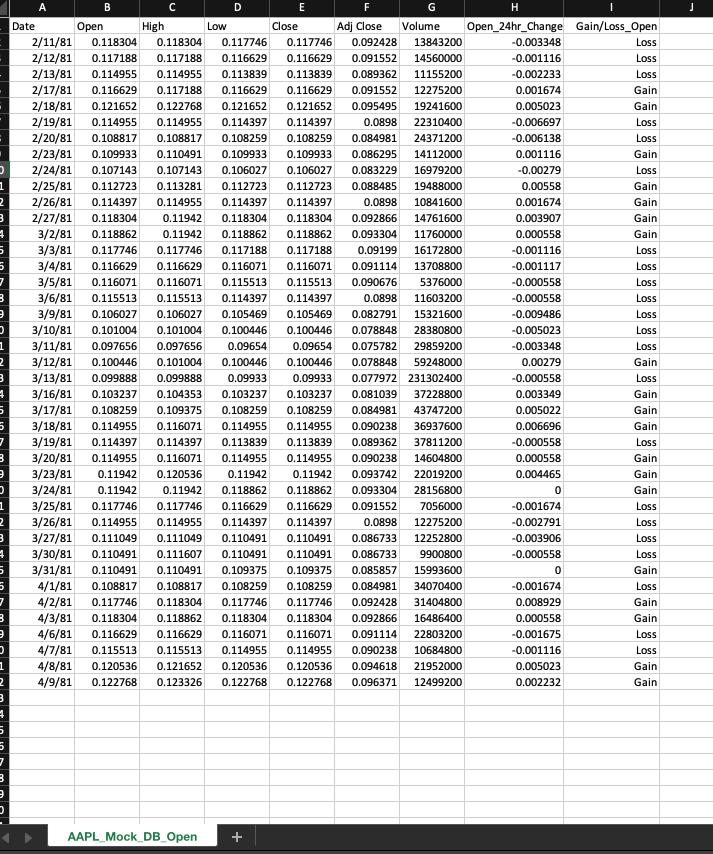

  - Joined_DB

    - 

Once the above steps are complete, the data will be ready for utilitzation in our chosen machine learning model. At the same time, something very important to note in the case of this project is that we have a total of four databases to create. One database for each type of stock pricing - Close, High, Low, and Open. The calculated column and Gain/Loss column formulas will be adjusted to calculate it's respective pricing column to the database's name. Therefore, here in this segment, we will be explaining our results of two sets of models, the Logistic Regression Model and the Random Forest Model. Each of them have their own set of databases with adjustments made to the formulated column to match each price variable. The list of database files are as follows:

- Logistic Regression Model Database Files

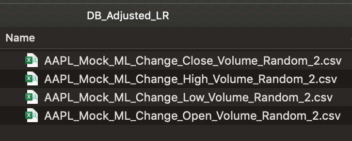

- Random Forest Model Database Files

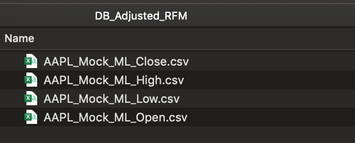

Once the databases are all complete and ready, we will move into using them for our chosen machine learning model.

### Machine Learning Mockup
In this section, we will be answering the following questions:
1. Which model did you choose and why?
2. How are you training your model?
3. What is the model's accuracy?
4. How does this model work?

**Which model did you choose and why?**

We have chosen the Random Forest Model. It contains a “Rank the Importance of Features” that allows us to see which features have the most impact on the decision. This is part of Ensemble Learning.
Other reasons for choosing random forest algorithms include:
- Are robust against overfitting 
- Can be used to rank the importance of input variables in a natural way, which will be very important to our end result of identifying what is the greatest factor of identifying major influencers of stock rises and falls
- Can handle thousands of input variables without variable deletion
- Are robust to outliers and nonlinear data

**How are you training your mockup model?**

Features: The variables used to make a prediction.
- Our features are seasons and fiscal quarters.

Target: The predicted outcome
- Our target is the stock price based on Gains/Losses (based on high, low, open, and close – all in separate models from each other)
        
The photo below represents the four separate databases that we will run through the Random Forest Model individually:

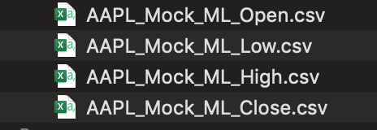

Throughout the remaining explanation of the machine model, we will be referring to the results of running our model with the AAPL_Mock_ML_Open.csv file. This same process will be applied with each of the database files separately. 

*Features*

In regard to the features, there are separate columns identifying the seasons and identifying the different quarters based on the stock pricing dates. The following photo is a snapshot of the fatures and target set being defined:

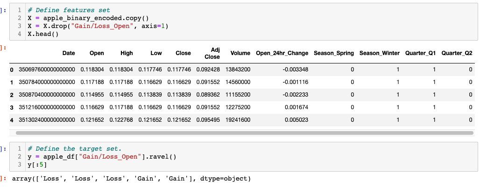

*Targets*

The first photo below shows the binary encoding, where we used get_dummies, and the second photo shows us dropping the column (Gain/Loss_Open, now known as "Gain_Loss_Open") so that it may be used as our target.

*Training*

Following these methods, we then proceed through training as follows:
- Splitting data into Train and Test sets
- Creating a StandardScaler instance
- Scaling the data
- Creating a random forest classifier
- Fitting the model
- Making predictions using the testing data
- Calculating the confusion matrix to observe how well training and testing performed

**What is the mockup model's accuracy?**

Currently, we have two models with different accuracies. We will seek consultation to verify which is most appropriate due to uncertainties of formulated columns that contribute to the features of the models. Each model set explained below has 4 models within it, each with their own accuracies: Open, Close, High, and Low.
- Accuracy of Model Set 1 - Logistic Regression:
  - Open: 50%
  - Close: 70%
  - High: 70%
  - Low: 70%

- Accuracy of Model Set 2 - Random Forest Model:
  - Open: 91%
  - Close: 91%
  - High: 91%
  - Low: 91%
    - For the Model Set 2- RFM, all four models ended up with the same Confusion Matrix. See image below that is based on the price variable "Open":
    
    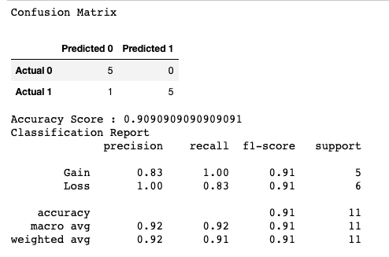

**How does this model work?**

This model was intended to function in a way that helps us predict future gains and losses based on historical prices, and then take the successful model and utilize it for an even closer look of Gains and Losses by Seasons and Fiscal Quarters. 

- Two additional columns were added to the database for model functionality/support

So far, we have gotten as far as creating models based on historical prices. The way that this works is that two formulated colums were added to our raw APPL dataset before joining the seasons and quarters database by date to the stock raw data by date. The first formulated column of the two was a "change variable" column. This column was formulated by taking one of the price variables (open, close, low, high) of the current day and subtracting it from the previous day's price. This would tell us how much the price has changed that day from the day before (the earliest day was subtracted from 0 as our starter). The second formulated column was a Gain_Loss column that was based on that change. This column was formulated to state "Loss" if the change was less than zero, and say "Gain" if the change was zero or greater. Because this file is a .csv file, the formula did not remain once the file was saved, the values became unformulated values instead. This situation does tie into why we have two separate sets of models rather than just one to choose from. This will be discussed a bit later.

- Model Set 1: Logistic Regression - Average 65% Accuracy, 3 out of 4 models at 70% accuracy

In model set 1, which is based on logistic regression, the database that was entered into the model was processed differently than the Random Forest Model, not just by the rules of the model itself, but also by the columns involved. To optain majority 70% accuracy, a change column was produced, not only on the price variable, but also on the volumes of stock purchased on a daily basis. 

Within one of the failed models, the change column was initially created to determine the Gain_Loss column, and then it was dropped within the "determine feature" section of the code. This was done for all price variables and I received very low accuracy scores. The accuracy was 56% and less for everything. When this process was done on the volume column of the stock, the model had a 70% accuracy score. It was at that moment that we explored the possibility of using volume change in addition to price changes to support the accuracy of the model's predictions on price variables further. As a result, the "Volume_24hr_Change" column became a set feature within the model along the other features. See the photo below (based on "Open" price variable):

- Model Set 2: Random Forest Model - Average 91% Accuracy, 4 out of 4 models at 91% accuracy

In model set 2, which is based on the random forest model, the database that was entered into the model was processed differently than the Logistic Regression Model, not just by the rules of the model itself, but also by the columns involved. To optain majority 91% accuracy, The change column of the price variable that was used determine the Gain_Loss column was kept in the database rather than dropped with the Gain_Loss column as the features' set was defined. See photo below:

The situation that makes choosing this model difficult is that we were told that the change column actually gives the machine model the answers to its own prediction, making it an inappropriate model, despite the 91% accuracy. We will continue consultation and testing, but if nothing works, we may seek out other options. A couple of items suggested is to bring in an additional dataset supporting APPL that can add additional features, or create my own features with the dataset we already have.

One of the main reasons this model was selected was because of its ability to rank the importance of our input variables to see how each variable influences the model overall. As you can see from the snapshots below, the change price variable column that remains in the database has the strongest weight above all other variables. Below is a snapshot of our rank of importance by each price variable:

- Open:

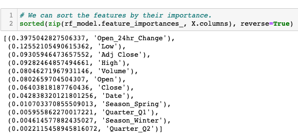

- Close:

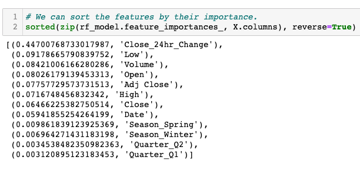

- Low:

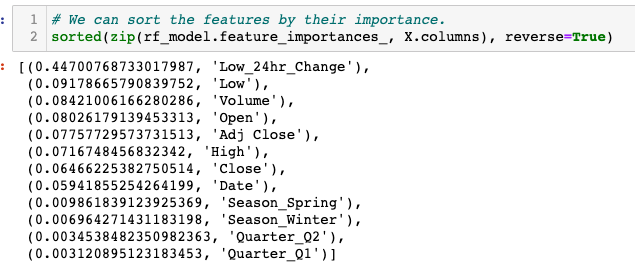

- High:

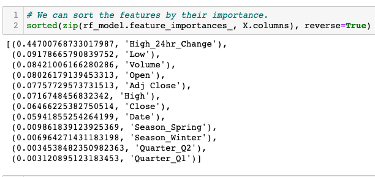

From the snapshots, most of these look alike because many of the prices, are the same, or have very small differences. The dataset is from a sample of APPL's early years.

**Conclusion to Mockup Overview**

In conclusion, we will continue testing models and seeking consultation based on our model experiences so far. By next class, we whould have found an additional dataset to help predict APPL stock fluctuations by bringing in more feature columns, if not create our own features through the dataset that we already have.

## Analysis and Workflow
### Software and applications used include:
Group GitHub account
Python 3.7.6
Pandas
R
SQL
AWS
pgAdmin
Tableau
Tableau Dashboards

### Machine Learning Model
In this segment of Machine learning, we discuss the following topics:

- Preliminary data pre-processing
- Preliminary feature engineering and preliminary feature selection, such as how the official model was decided
- Methodologies
- The Three Architectures Tested
- How the data is split into training and testing sets
- Model choice, its' limitations, and its' benefits

**Preliminary Data Pre-processing**

The data pre-processing was approached through answering what exactly it was we were trying to answer of ourselves and others as it relates to stock. In our base dataset, the following columns were included and are our feature columns:
- Date
- Open
- High
- Low
- Close
- Adj Close
- Volume

After observing the dataset and creating our question for which we seek results, we then decided on the additional features would be needed:
- Seasons
- Quarters
- 24hr price change columns for each price variable (high, low, open, and close), and for the volume
- A Gain/Loss column based on the negative or positive status of each price variable's 24hr change column and the volume's 24hr change column as well

The new columns based on date, seasons, and fiscal quarters were needed to answer our most sought out questions. To create it, many formulas were utilized, therefore we separated it into a 2nd database with intention to join the two databases together as one via "Date".

**Preliminary Feature Engineering and Feature Selection**

The previous slide discusses our features, and our target column of our machine learning code is based on the 24hr changes of our price variable feature columns. Our machine learning model is of four models overall, but it is based on one single database. The target columns are our “Gain_Loss_<Price_Variable>” column. This column is based off of the numbers in “<Price_Variable>_24hr_Change” column and is demonstated in the database as the following:
- “< 0 = ‘Loss’”
- “>= 0 = ‘Gain’”

The “<Price_Variable>_24hr_Change” or “<Price_Variable>_Change” column is based on the (current price - previous day’s price) for everyday of Apple’s stock in chronological order by “Date”. The Gain/Loss column identifies the respective change column as a negative or positive number, in which it then labels that row as a "Gain" or a "Loss"

Based on Machine Learning studies, the target is based on two options - either, or - only. Examples are: 0 or a 1 Yes or No Approve or Deny Gain or Loss The Gain/Loss of the stock price features by day is the best engineered feature to base the stock’s machine learning model, because that is what is important to the people who will use it to their own benefit

### Machine Learning Testing and Training Split
**Methodologies**

Two models were tested, the Logistic Regression and the Random Forest Model, and each of the two had a total of three different architectures applied 

In both the Logistic Regression and the Random Forest Model:
- Random state = 1, 
- stratify = y, and 
- the sample consisted of 7669 rows: 17 columns of our base architecture model, or 7669 rows: 18 columns for our model with our stock volume considerations, and lastly 7669 rows: 21 columns in model that has all change columns considered at once
- However, in the Random Forest Model, although set up similarly to the Logistic Regression:
  - It did receive a higher accuracy by 3-5% upon changing the Random State from 78 to 1 in the models that considered price variables as targets 
  - Alternatively, it received the best accuracy when the Random State was left at 78 for the models that considered the volume variable as the target instead of the price variables , as well as trained with 80% of the data

**Three Architectures Tested**
- Structure 1: Base Dataset Features + Volume 24hr Change Feature + (1 of 4) Price Variable 24hr Change Columns as the Target
  - Total of 4 sub-models based on the Gain_Loss of the price variable’s 24hr Change:
    - Open
    - Close
    - High 
    - Low
- Structure 2: Base Dataset Features + Volume 24hr Change Column as the Target
  - A model based on the volume’s 24hr change column with its respective Gain_Loss column as the target
- Structure 3: Base Dataset Features + All Price Variable 24hr Change Features + Volume 24hr Change Column as the Target 
  - A model based on all price variable 24hr changes at once rather than separately, and the volume’s respective Gain_Loss column as the target

**Accuracy: Logistic Regression**
- Price Variables:
  - Low = 56%
  - Close = 54%
  - High = 55%
  - Open = 54% Volume Variables:

- With Volume 24hr Change Column
  - 58%

- With All Price Variable 24hr Change Columns present, but no Volume Change column
  - 58%

**Accuracy: Random Forest Model**
- Price Variables:
  - Low = 61%
  - Close = 63%
  - High = 60%
  - Open = 58% Volume Variables:

- With Volume 24hr Change Column
  - 66%

- With All Price Variable 24hr Change Columns present, but no Volume Change column
  - 72%

**Model Choice, Model Limitations & Benefits**

Two Machine Learning models were tested for this data. Both Logistic Regression and Random Forest Model were great choices because everything is measured through time and time runs linear. We officially settled on the Random Forest Model because, not only is it a regression that works well in time, but it is beneficial in weighing the importance of each feature. Model limitations include the fact that for time, date format was not enough for the model to read. We had to convert dates to “toordinal” time in order for the machine model to interpret dates as a form of time in a language that was it’s most favorable, and that turned out to be the “toordinal” language. 

## Results
### Machine Learning
The following two images are the Confusion Matrix and the Importance Features which ranks the importance of each feature that resulted in the current accuracy score in our Random Forest Model:

*Confusion Matrix*

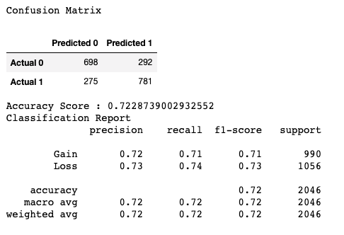

*Importance Features*

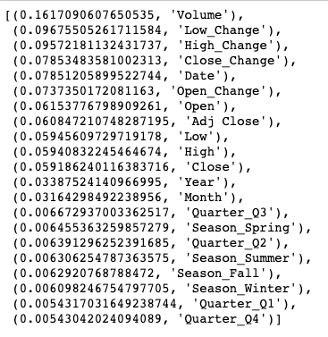

### Database
- https://youtu.be/r4HjviCTEOM

### R Analysis
- file:///Users/Irei/Desktop/Desktop/Analysis_Projects/Final_Project_AAPL/Final_Project_10_UTA/SEGMENT%202/R-Analysis/Final-Ranalysis.nb.html

### Candlestick Analysis
The apple share price was compared over a period of 5 years and it was obvious that there was a steady increase in price over a period of 5 years. 

There’s usually a rise in volume at the beginning of every year until 2020 when there was a deep, the reason for this is not far fetched- the pandemic!

The price and volume variations for each decade was also analyzed and it shows that in the year 1990, there was a deep in price and a rise in volume towards the end of the year (October), the same can be said about the year 2000, whereas in the year 2010, there was a rise in volume and a drop in price in January while in 2020, the lowest price and volume was experienced in April (right after the pandemic lockdown), however, the price started picking up in September but the volume did not pick up until December.

### Dashboard
The dashboard contains worksheets, dashboard and stories that explains the connection between Seasonal, Quarterly and Monthly Gain/Loss. Attached id the link to the dashboard:
- https://public.tableau.com/app/profile/opy.shoffy/viz/Final_Project_10_16277782240420/QuarterlyGainLoss

## Summary
### Concluding Observations Made in Machine Learning
In conclusion, our analysis of Machine Learning, R-analysis, and Dashboard Demonstrations support the following:
- Volume was significant to accuracy of Gain/Loss predictions
- When combined with volume, the “Open” price variable weighed the most of all price variables
- Opportunity for gains were most significant:
  - Spring ranked highest in importance, with summer tightly following
    - Spring: Mar 1 – May 31
    - Summer: June 1 – Aug 31
  - The 3rd Fiscal Quarter ranked as the highest quarter
    - July 1 – Sept 30
- Moments of the greatest losses occurred:
  - In the winter season
    - Dec 1 – Feb 28
  - Tie between the 1st and 4th Fiscal Quarter
    - 1st Q: Jan 1 – Mar 31
    - 4th Q: Oct 1 – Dec 31

### Project Website
The following link is Team 10's official project website:
- https://team10-aaplwebsite.herokuapp.com/

###  Project Google Slides
The following link is Team 10's official presentation slides:
- https://docs.google.com/presentation/d/e/2PACX-1vSpzQI6TkPFjoynBgNyYNsSfVA9UIz0DWSO41RmK-gQXxzM5FsWMc_qbdY6wszSeM9mA_WJXgwjgsmN/pub?start=false&loop=false&delayms=3000
